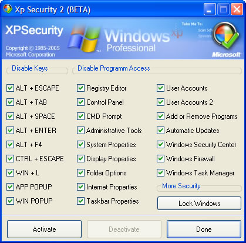



## Xp Security 2

### Description

Protect your Windows at anytime... the right ways..
 
### More Info
 

             |
---                |---
**Submitted On**   |2005-06-13 11:14:12
**By**             |[Jovica Mizdrak](https://github.com/Planet-Source-Code/PSCIndex/blob/master/ByAuthor/jovica-mizdrak.md)
**Level**          |Advanced
**User Rating**    |5.0 (40 globes from 8 users)
**Compatibility**  |VB 5\.0, VB 6\.0
**Category**       |[Coding Standards](https://github.com/Planet-Source-Code/PSCIndex/blob/master/ByCategory/coding-standards__1-43.md)
**World**          |[Visual Basic](https://github.com/Planet-Source-Code/PSCIndex/blob/master/ByWorld/visual-basic.md)
**Archive File**   |[Xp\_Securit1901236142005\.zip](https://github.com/Planet-Source-Code/jovica-mizdrak-xp-security-2__1-61126/archive/master.zip)

